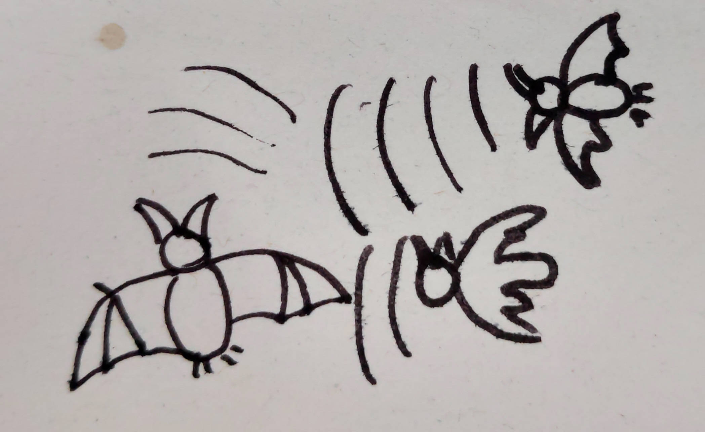
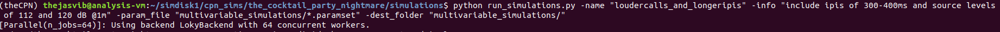
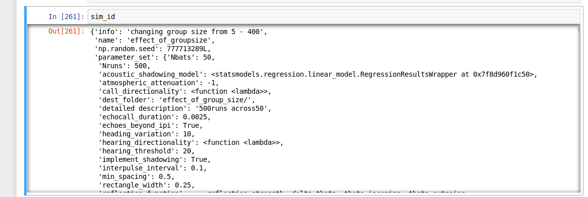
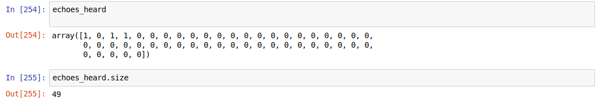
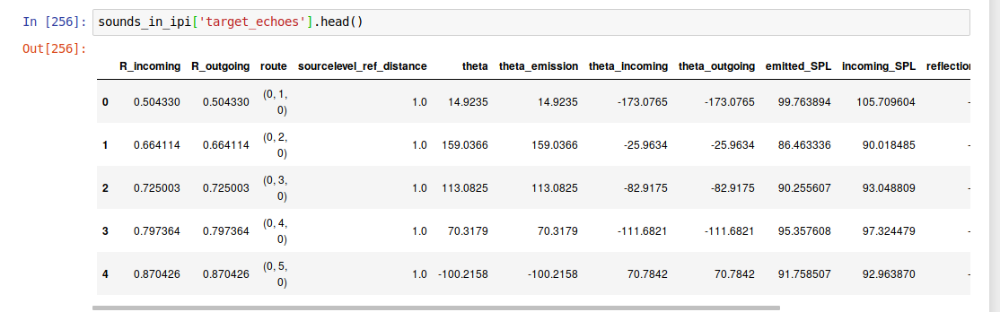
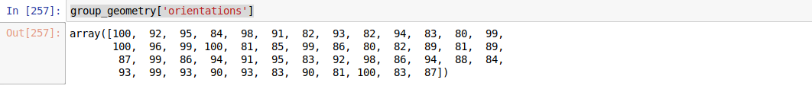
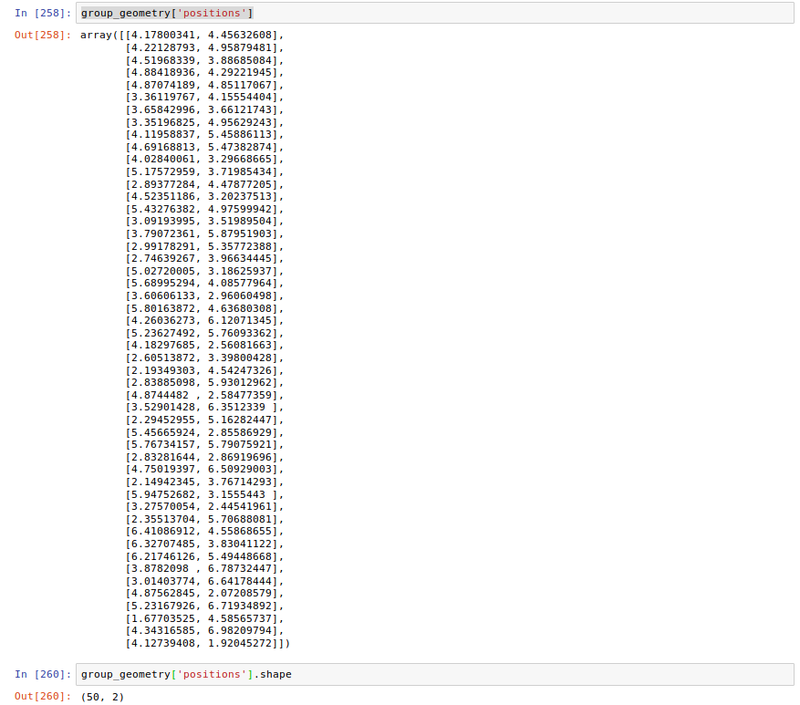

# The Cocktail Party Nightmare

#### Author : Thejasvi Beleyur, Max Planck Institute for Ornithology, Seewiesen.
#### Last Updated : October 2019

Code associated with the manuscript 'Active sensing in groups: (what) do bats hear in the sonar cocktail party nightmare' - Beleyur & Goerlitz 2019 <LINK TO PREPRINT HERE>

[](https://doi.org/10.5281/zenodo.3514156)

### What is the repository about?
The code in this repository simulate what a bat flying in a group of other bats may be experiencing. Echolocating bats fly in the night and live in caves where they cannot 'see' objects with their eyes like we do. They emit loud calls and listen to the returning echoes to detect their surroundings. See [here](https://www.cell.com/current-biology/fulltext/S0960-9822(05)00686-X) for a quick review. 

Echolocation works very well when individual bats are flying around alone while hunting or commuting. However, when there are  loud sounds, such as those from other bats - the faint returning echoes may not be heard. This means that when a bat flies close to many other bats - it may be flying metaphorically 'blind'. However, many bat species are very social, and live in large groups, fly around together in caves and even emerge in the millions - the Mexican Free-Tailed bat is a classic example. 

The problem of listening to a target signal in the presence of louder sounds that affect signal detection has been called the 'cocktail party problem' by [Cherry 1953](https://asa.scitation.org/doi/10.1121/1.1907229), (also the [wikipedia article](cocktail party problem/effect](https://en.wikipedia.org/wiki/Cocktail_party_effect))). In the context of bat echolocation, given the orders of magnitude louder bat calls and the large number of calls and echoes that need to be dealt with when flying in a group - [Ulanovsky & Moss 2008](https://www.pnas.org/content/105/25/8491.short) termed group echolocation a 'cocktail party nightmare'. 

This repository simulates the auditory detection of echoes, sound propagation and other relevant phenomena that occur in the cocktail party nightmare and quantifies how many neighbours a bat may be detecting as it flies in a group. For more detail on the simulation implementation please refer to the associated paper <LINK TO PREPRINT HERE>. 


### Requirements:
The code runs on a range of Python 2.7 versions. The code runs on Windows and Linux. 
To replicate the development environment exactly - install the following versions in your conda/virtual environment. All simulation results generated for the paper were done on a Ubuntu 18.04.3 LTS virtual machine. The code was also tested and developed on a Windows 7 system too (and any problems in running the code are likely issues with finding the right packages for the OS?).

Python 2.7.15

matplotlib==2.2.4

setuptools==40.4.3

tqdm==4.35.0

pandas==0.24.2

joblib==0.13.2

numpy==1.14.2

statsmodels==0.10.1

scipy==0.19.1

dill==0.3.0

### Installing the required Python environment:
It is a good idea to always use environments for each project. Environments are unique ''boxes' that have their own installation of Python and dependent packages ([article on environments](https://protostar.space/why-you-need-python-environments-and-how-to-manage-them-with-conda)).

I used an [Anaconda](https://docs.anaconda.com/anaconda/) Python installation. The conda version used was 4.7.10. Here are the steps to recreate the environment.
```
# create a conda environment called theCPN with python 2.7.15
conda create --name theCPN python=2.7.15
# activate the environment
conda activate theCPN 
# install the pip package
conda install pip
# install all of the required dependency packages to run the simulations
pip install -r requirements.txt
```
-- these steps worked on an Ubuntu 18.04. It should work on other operating systems too. However, I also faced an issue with the steps above on my Windows 7 with a 'RuntimeError: Python version >= 3.5 required.' message when I tried to ```pip install -r requirements.txt``` . The solution was to install numpy first, then pandas, and then the rest - so:
```
pip install numpy==1.14.2
pip install pandas==0.24.2
pip install matplotlib==2.2.4 setuptools==40.4.3 tqdm==4.35.0 joblib==0.13.2 statsmodels==0.10.1 scipy 1.2.1==0.19.1 dill==0.3.0
```


### Running simulations described in the paper: 4 steps to re-running it on your system
All simulation code is in the 'simulations' folder. Every set of simulations is defined by a parameter file which sets the number of simulation runs, call properties, group size and other relevant parameters. The simulations themselves are run by calling the ```run_simulations``` module through a command line call. Let's go through it step by step.

Before you begin trying to run the simulations - first make sure you have fired up a Terminal window (Unix) or a Command Prompt (Windows) and move into the 'the_cocktail_party_nightmare' repository.

#### Step 0 : Generate the common parameter file
The difference simulation scenarios rely on a common set of parameters that they then alter according to the situation. Generate the common parameter set first to allow the creation of more specific simulation parameter sets. Generate the common simulation parameter file by running the following command 
```
cd simulations/
python create_and_save_common_simparameters.py
```
Running this will lead to the creation of a ```'common_simulation_parameters.paramset'``` file in the folder. The ```.paramset```  extension defines a parameter file. 

##### What is a parameter file?
A parameter file consists of a dictionary with simulation parameters. 
The file is created by saving the dictionary through the [dill](https://pypi.org/project/dill/) package. Having setup the parameters you can simply run the 'make.. .py' file and you should get a bunch of ```.paramset``` files in your folder. 
The ```make_<simulation_type>.py``` modules in each simulations scenario ('effect_of_group_size, effect_of_position, multivariable_simualtions') are the reference examples. 

#### Step 1 : Setting up a simulation by creating specific parameter files
To start with if you want to recreate the simulations that have been run in the paper, you can directly run the ```make_<simulation_type>.py``` module directly through an IDE like Spyder or run it from the command line with the following commands. 
Alter parameters in the 'make_params' files through the text editor of your choice.

For instance, at least in the beginning keep the group size small (all_group_sizes = [10, 50]), and run only a few simulation runs (number_of_simulation_runs = 1).
```
# move into the directory where the make .py module is. 
cd simulations/effect_of_group_size
python make_params_groupsize.py
```
Note : The #'s are comments - please do not copy-paste them into your comm

You should now see multiple ```.paramset``` files in the folder, each of which has the parameters required to initiate simulations for the different group sizes. 

#### Step 2 : Starting the simulations
The simulations are initiated through the ``` run_simulations.py``` module in the simulations folder. The ```run_simulations``` module initiates the appropriate number of simulations runs as described by each parameter file in a folder, and saves the simulation outputs into the given destination folder. 

#### Starting simulations runs 
```
#Change directories back to the 'simulations' folder. 
cd the_cocktail_party_nightmare/simulations/
# run effect of group size simulations 
python run_simulations -name "groupsize_effect" -info "a trial run to see if things work okay" -param_file "effect_of_group_size/*.paramset" -dest_folder "effect_of_group_size/" -numCPUS 2
```

The ```-name``` argument will set the prefix for all simulation output files. Here all outputs will start with 'groupsize_effect'.

The ```-info``` argument will be saved into the simulation output so you can quickly refer to what it is that was being run without actually loading the information. 

The ```-param_file``` argument refers to the folder and file format of the parameter files to be used to initiate the simulations. 

The ```-dest_folder``` argument refers to the destination folder for all the simulation outputs. 

The ```-numCPUS``` refers to the number of CPUs that are to be used to run the simulations in parallel. Simulations with larger group sizes (>50 bats) can be intensive and make an impact on your user-experience if you plan to do other things. It may then be wise to limit the number of CPUs that are being used for the simulations. The number of CPUs defaults to the number available on the device if not specified. 

#### What a succesful simulation initiation looks like : 


#### Step 3 : The simulation outputs
Every simulation run produces its own ```.simresults``` file. This file is a dill-pickled file that contains information on 
* a) the parameters that were used to run the simulation and the random seed that can be used to re-run the exact same simulation run on any operating system if need be. 

* b) the results of the simulation run

a) and b) are stored as a tuple with two objects. a) is called the *simulation_identifier* as it can be used to uniquely identify a simulation and replicate it, b) is called the *simulation_data* as that is what we will use for further analyses. 


#### Loading, analysing and handling simulation outputs :
The Jupyter Notebooks in the 'analysis' folder provide a more detailed glimpse of how to proceed with handling and analysing the simulation results - but here is a brief glimpse. 

#### Checking out the simulation identifiers
The simulation identifier object is a dictionary with a key for each relevant entry.
```
# open a Python session or a Jupyter Notebook

# load the .simresult files
import dill 
import numpy as np 
import sys 
sys.path.append('../CPN/') # I'm not sure why but the data loading throws an 
# error if the 'CPN' folder is not in the search path - help appreciated!

# load the simresult file 
with open('<your simulation run output file here>.simresults', 'rb') as simfile:
    one_sim_run = dill.load(simfile)

# unpack the simulation identifiers and simulation data 
sim_id, sim_data = one_sim_run 

# display some of the simulation identifiers
print(sim_id)
```


#### Checking out the simulation data :
The simulation data is a list with 3 objects in it:  the echoes heard, the sounds in the interpulse interval, group geometry.

```
# unpack the simulation data into its three component objects
echoes_heard, sounds_in_ipi, group_geometry = sim_data 
```


* i) echoes heard : 1 x Nbats-1  np.array with 0/1 for representing whether the echo corresponding to a neighbour was heard or not. 0 is not heard, 1 is heard. The indexing used in this 1/0 array is shared with that used in group geometry with a +1 added. This is because the focal bat cannot hear the echo reflecting from its own body!

If an array were to look like:
[0,1,0,0,0] - this means the i=1 st index neighbour was detected. To get the xy and heading position of the +1 must be added - and so the xy position and heading of the i =2 nd bat must be accessed in the group geometry object.

An example from a simulation run with 50 bats, and thus only 49 entries : 


* ii) sounds in the interpulse interval :  a dictionary with 3 Pandas DataFrames describing the details of each sounds 
path to the focal bat, its time of arrival in the interpulse interval, the distance it travelled, the angle at which it arrived etc. 

  * 1. target echoes :  the echoes generated by the focal bat that are reflected off its neighbours. 
  * 2. secondary echoes : the echoes *not* generated by the focal bat, but from emissions of neighbouring bats.
  * 3. conspecific calls : the neighbouring bat calls. 
  
Here is an exmaple of the target_echoes DataFrame detailing the path the echo ('route') took amongst other things


 *  iii) group geometry : a dictionary with the heading directions and xy positions of all bats in a group. Headings refer to the direction a bat is flying in and aiming its sonar beam at. 
 
      orientations : Nbats x 1 np.array with azimuth headings ranging from 0-360 degrees. The 0th index orientation corresponds to the focal bat. 
        
      positions : Nbats x 2 np.array with xy coordinates of the group of bats. The 0th row corresponds to the xy positions of the focal bat. 


#### Read till here and want to know more? 
 Please do not hesitate to contact me if you 
 a) have tried to replicate the results and are having issues
 b) have ideas on how this project can be developed  
